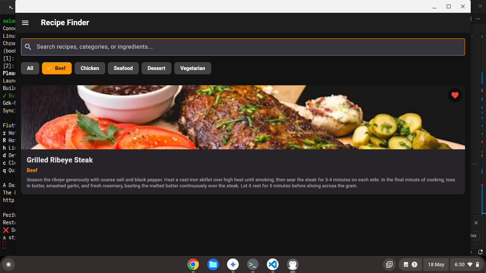
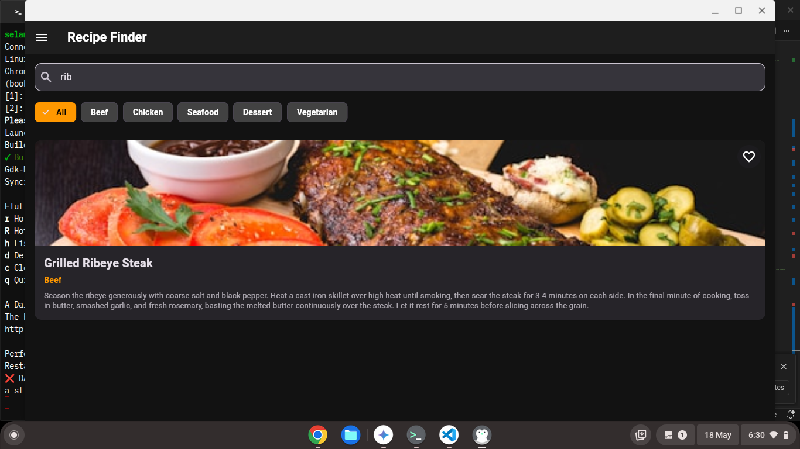
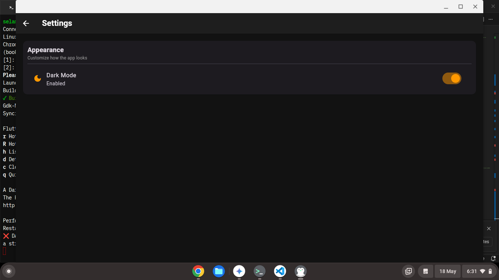

# Recipe Finder App

A mobile application built with Flutter utilizing Clean Architecture principles and the Provider state management pattern. The app fetches data dynamically from a backend API service and manages application lifecycle states cleanly.

## Student Information
* **Name:** Selamawit Mulat
* **Section:** 1
* **ID / UGR:** UGR/1033/16
* **GitHub / Username:** SelamawitMulat

---

## Key Features & Architecture
* **State Management:** Uses `ChangeNotifierProvider` to decouple business logic from the user interface.
* **Network Handling:** Connects to a dedicated `RecipeService` backend API layer.
* **Dynamic Search & Filtering:** Allows users to filter culinary items instantaneously by predefined food categories (Beef, Chicken, Seafood, Dessert, Vegetarian) or manual text queries.

---

## HTTP Server Request & Connection Flow

The application communicates with a local backend server via asynchronous HTTP network requests. The runtime behavior depends entirely on the status of this connection:

1. **Initiating the Request:** When the application boots or the user clicks **Retry**, the state provider invokes `_recipeService.getRecipes()`, dispatching an HTTP `GET` request to retrieve the raw recipe payload.
2. **Successful Response Processing:** Upon receiving a successful HTTP status code (200 OK) from the server, the provider parses the incoming JSON data into a model list. It sets the error state flag (`_errorMessage`) to a completely empty string (`''`). This allows the UI layer to bypass error layout validation and smoothly render the data deck.
3. **Graceful Exception Catching:** If the host system detects a dropped WiFi signal or a closed backend server port, the underlying network client throws a low-level socket exception. The provider catches this error immediately, clears out memory arrays to prevent interface corruption, and populates a meaningful connection error string.

---

## App States Implemented

### 1. Loading State
When fetching recipes initially or upon hitting a retry cycle, the UI non-blockingly displays a localized `LoadingWidget` indicator for 5 seconds to show asynchronous processing.

### 2. Error State (Network Disconnection)
If the host device loses its active network/WiFi connection, the network call catches a fallback exception. The app displays a dedicated `CustomErrorWidget` panel containing an error message along with an orange action button.

### 3. State Continuity (Retry Logic)
When the user clicks the **Retry** button inside the error state:
* **If connection is still broken:** The app safely attempts a fetch, re-catches the network failure, and remains on the error screen.
* **If connection is restored:** The app successfully fetches data from the backend API, instantly clears out the application error flag (`_errorMessage = ''`), and brings the user seamlessly to the Home Grid view.

---

## Application Walkthrough Screenshots

### Home & Navigation
* **Home Page (Dark Mode):**
  
* **Category Filtering:**
  
* **Recipe Search:**
  
* **Navigation Drawer (Side Bar):**
  

### Favorites System
* **Toggling Favorites on Home Screen:**
  
* **Favorites Collection View:**
  

### Recipe Details & Cooking Notes
* **Recipe Details (Before Notes):**
  
* **Adding a Custom Cooking Note:**
  
* **Saving Note Progress:**
  
* **Detail Page (After Note Attached):**
  
* **Deleting a Custom Cooking Note Modal:**
  

### Settings & App Profile
* **Theme Preferences Settings:**
  
* **About Application Developer Panel:**
  