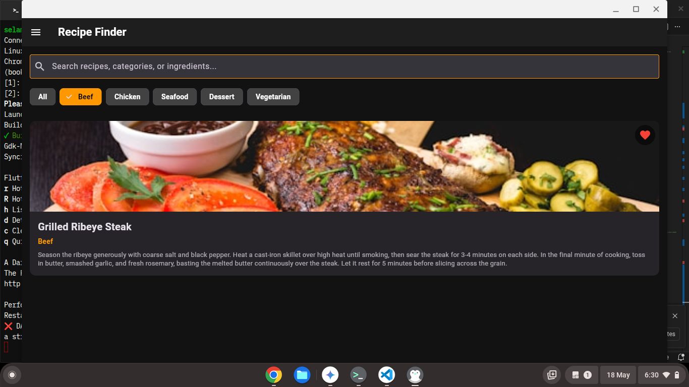
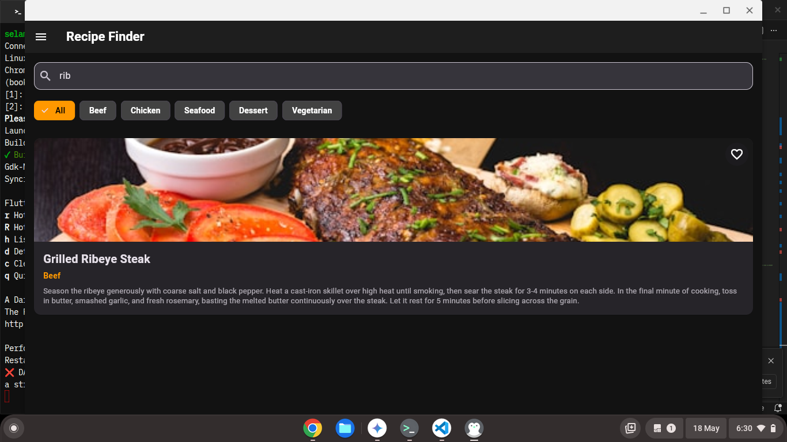
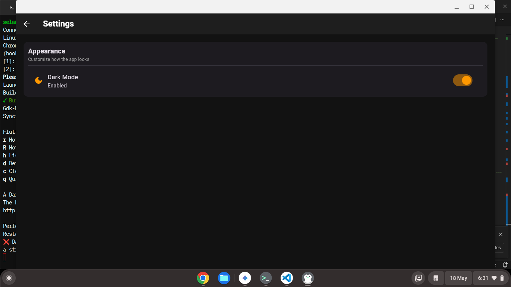

# Recipe Finder App

A mobile application built with Flutter utilizing Clean Architecture principles and the Provider state management pattern. The app fetches data dynamically from a backend API service and manages application lifecycle states cleanly.

## Student Information
* **Name:** Selamawit Mulat
* **Section:** 1
* **ID / UGR:** UGR/1033/16
* **GitHub / Username:** SelamawitMulat

---

## Key Features & Architecture
* **State Management:** Uses `ChangeNotifierProvider` to decouple business logic from the user interface.
* **Network Handling:** Connects to a dedicated `RecipeService` backend API layer.
* **Dynamic Search & Filtering:** Allows users to filter culinary items instantaneously by predefined food categories (Beef, Chicken, Seafood, Dessert, Vegetarian) or manual text queries.

---

## HTTP Server Request & Connection Flow

The application communicates with a local backend server via asynchronous HTTP network requests. The runtime behavior depends entirely on the status of this connection:

1. **Initiating the Request:** When the application boots or the user clicks **Retry**, the state provider invokes `_recipeService.getRecipes()`, dispatching an HTTP `GET` request to retrieve the raw recipe payload.
2. **Successful Response Processing:** Upon receiving a successful HTTP status code (200 OK) from the server, the provider parses the incoming JSON data into a model list. It sets the error state flag (`_errorMessage`) to a completely empty string (`''`). This allows the UI layer to bypass error layout validation and smoothly render the data deck.
3. **Graceful Exception Catching:** If the host system detects a dropped WiFi signal or a closed backend server port, the underlying network client throws a low-level socket exception. The provider catches this error immediately, clears out memory arrays to prevent interface corruption, and Populates a meaningful connection error string.

---

## App States Implemented

### 1. Loading State
When fetching recipes initially or upon hitting a retry cycle, the UI non-blockingly displays a localized `LoadingWidget` indicator for 5 seconds to show asynchronous processing.

### 2. Error State (Network Disconnection)
If the host device loses its active network/WiFi connection, the network call catches a fallback exception. The app displays a dedicated `CustomErrorWidget` panel containing an error message along with an orange action button.

### 3. State Continuity (Retry Logic)
When the user clicks the **Retry** button inside the error state:
* **If connection is still broken:** The app safely attempts a fetch, re-catches the network failure, and remains on the error screen.
* **If connection is restored:** The app successfully fetches data from the backend api, instantly clears out the application error flag (`_errorMessage = ''`), and brings the user seamlessly to the Home Grid view.

```
### Screenshots

 1.  Home page


2. home with favorites toggle

  

3. selected recipe on favorites page 


4. home with category filtering 



5. home with serch filtering 



6.recipe detail screen  before adding note


7. add note form


8 saving note 


9.recipe detail screen after adding the note 


10. delet note modal 


11.side bar of app 


12. setting page 



13.after light mode


14. about page


15. home after light mode


16. Loading Home

 

 17. error page 

 

